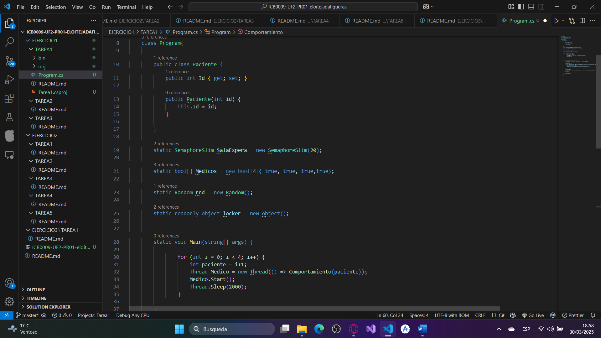
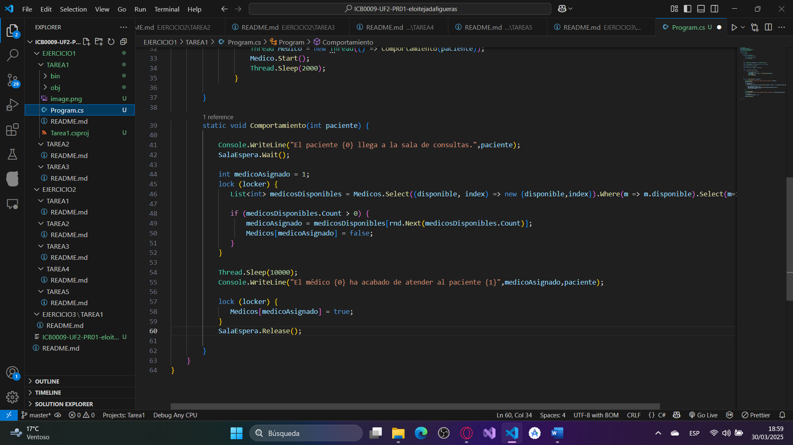

# ICB0009-UF2-eloitejadafigueras

## ¿Cuántos hilos se están ejecutando en este programa? Explica tu respuesta. 
Se estan ejecutando 5 hilos, los 4 hilos que se crean en el bucle for, y el hilo principal del programa.
## ¿Cuál de los pacientes entra primero en consulta? Explica tu respuesta.
El primero que cree el bucle for, porqué simplemente se le asigna el "1" al primero en generarse.
## ¿Cuál de los pacientes sale primero de consulta? Explica tu respuesta.
Saldrá el "1"/primero en generarse, porque todos esperan 10 segundos para salir, ya que el "1" fué el primero en entrar, será también el primero en salir.

### En el main:
for (int i = 0; i < 4; i++) {
                    int paciente = i+1;
                    Thread Medico = new Thread(() => Comportamiento(paciente));
                    Medico.Start();
                    Thread.Sleep(2000);                
                }
#### Iteramos 4 veces con un bucle for donde definimos una variable paciente(es la que enumera cada paciente) igual al numero de iteraciones de la variable, más 1(para que así sea del 1 al 4 y no del 0 al 3). Creamos un nuevo Thread llamado Medico, que ejecutará "Comportamiento" a través de una función lambda. Iniciamos el Thread y esperamos 2 segundos a través del método .Sleep() antes de inicializar el siguiente Thread.

### En la función Comporamiento:
Console.WriteLine("El paciente {0} llega a la sala de consultas.",paciente);
            SalaEspera.Wait();
            
            int medicoAsignado = 1;
            lock (locker) {
               List<int> medicosDisponibles = Medicos.Select((disponible, index) => new {disponible,index}).Where(m => m.disponible).Select(m=>m.index).ToList();
### Escribimos por consola el numero del paciente que entra en la consulta, ejecutamos un .Wait() en el semáforo y creamos la variable medicoAsignado. El siguiente código está protegido por un Lock, ya que accedemos a una variable global. Lo que hacemos es convertir nuestro Array de Bools {true,true,true,true} en una lista donde, a través del el .Select(), le damos un numero a cada miembro de la lista("disponlible") con "index", el .Where() filtra nuestra lista para que solo se seleccionen los médicos disponibles(los miembros del la lista en "true"), y el .ToList() lo convierte en una lista.              
               if (medicosDisponibles.Count > 0) {
                   medicoAsignado = medicosDisponibles[rnd.Next(medicosDisponibles.Count)];
                   Medicos[medicoAsignado] = false;
               }
            }
### El condicional if chequea que hayan médicos disponibles, y asigna uno de los médicos aleatoriamente de entre el número de médicos disponibles, cambiando su estado a "false"(así ya no sale en la lista para el siguiente Thread).
###
            Thread.Sleep(10000);
            Console.WriteLine("El médico {0} ha acabado de atender al paciente {1}",medicoAsignado,paciente);
### Esperamos los 10 segundos que tarda cada consulta a través del método .Sleep() y comunicamos por la consola que el médico ha acabado de atender al cliente.
            lock (locker) {
               Medicos[medicoAsignado] = true;
            }
            SalaEspera.Release();
### Volvemos a usar un Lock para actualizar el estado del médico, para que así vuelva a salir como disponible para el siguiente Thread que ejecute la línea de código anterior.
### Finalmente ejecutamos un .Release() para liberar esa plaza del semáforo.

