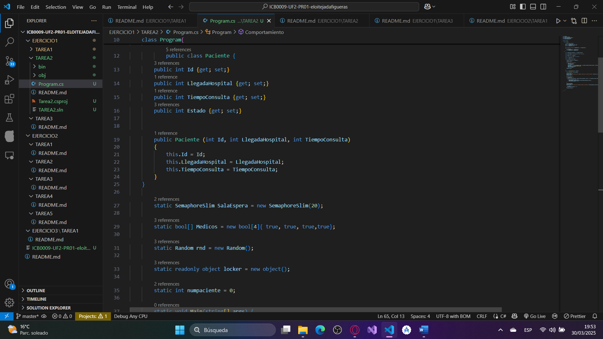
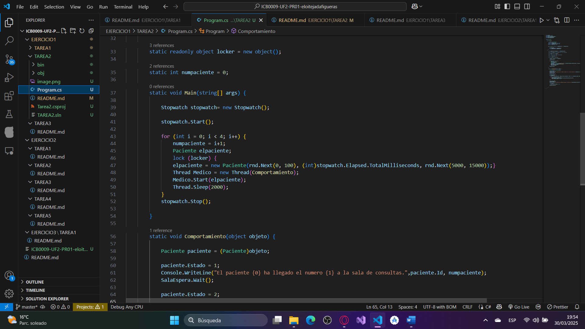
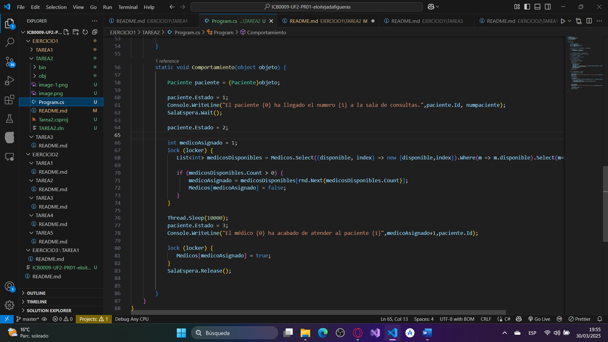

# Tarea 02

## ¿Cuál de los pacientes sale primero de consulta? Explica tu respuesta.
No se puede saber antes de ejecutar el código, porque al hacer aleatorio el tiempo de estáncia del Cliente, tienen distintos tiempos.

    public class Paciente {
        public int Id {get; set;}
        public int LlegadaHospital {get; set;}
        public int TiempoConsulta {get; set;}
        public int Estado {get; set;}

        public Paciente (int Id, int LlegadaHospital, int TiempoConsulta)
        {
            this.Id = Id;
            this.LlegadaHospital = LlegadaHospital;
            this.TiempoConsulta = TiempoConsulta;
        }
    }
### Esta declaración de clase la he copiado directamente del documento de entrega. Si tengo que explicarlo:
### Declaramos una clase con las siguientes variables: Un Id, del tipo int para identificar a cada cliente, una variable "LlegadaHospital" también del tipo int, que será la que almacene la hora de llegada al hospital, una variable llamada "TiempoConsulta" del tipo int que almacenará el tiempo que tardará el Cliente en la consulta, y la última variable, la variable "Estado" del tipo int que nos comunica el estado del Cliente, yo he hecho que tenga tres estados, "1","2"y"3", equivalente a "no atendido", "siendo atendido" y "ya atendido".

        static void Main(string[] args) {

            Stopwatch stopwatch= new Stopwatch();
            
            stopwatch.Start();
            ### Creamos una variable StopWatch para contabilizar el tiempo, y la iniciamos con .Start().
            for (int i = 0; i < 4; i++) {
                numpaciente = i+1;
                Paciente elpaciente;
                lock (locker) {
                elpaciente = new Paciente(rnd.Next(0, 100), 0, rnd.Next(5000, 15000));
                }
### Este for tiene de diferente que crea una variable de la clase Paciente, y, dentro de un lock declara sus variables, vemos que el Id se declara con un numero aleatorio entre 0 y 100, delcara la "LlegadaHospital" en 0(aún no ha llegado, se actualizará más adelante), y otro numero aleatorio entre 5000 y 15000 para la variable "TiempoConsulta", que serán los milisegundos que deberá esperar siendo atendido.

                Thread Medico = new Thread(Comportamiento);
                Medico.Start(elpaciente);
                Thread.Sleep(2000);                
### Creamos un Thread Medico, que ejecutará la función Comportamiento con los datos de la variable "elpaciente", y esperará 2000 milisegundos a través del método .Sleep() para ejecutar la siguiente iteración del bucle.
            }
            stopwatch.Stop();
### Finalizaremos el stopwatch antes de acabar el programa.
        }

static void Comportamiento(object objeto) {

            Paciente paciente = (Paciente)objeto;
### Ahora ya no accedemos a esta función con un lambda, así que obtenemos de vuelta la información de la variable object, en una variable Paciente.
            paciente.Estado = 1;
### Actualizamos el estado del paciente a 1.(No atendido)
            Console.WriteLine("El paciente {0} ha llegado el numero {1} a la sala de consultas.",paciente.Id, numpaciente);
            paciente.LlegadaHospital(int)stopwatch.Elapsed.TotalMilliseconds;
            SalaEspera.Wait();
### Comunicamos que paciente a llegado y qué posición está en la cola al llegar, apuntamos su hora de llegada y ejecutamos un .Wait en el semáforo.
            
            paciente.Estado = 2;
### Actualizamos el estado del paciente a 2.(Siendo antendido)
            int medicoAsignado = 1;
            lock (locker) {
               List<int> medicosDisponibles = Medicos.Select((disponible, index) => new {disponible,index}).Where(m => m.disponible).Select(m=>m.index).ToList();
             
               if (medicosDisponibles.Count > 0) {
                   medicoAsignado = medicosDisponibles[rnd.Next(medicosDisponibles.Count)];
                   Medicos[medicoAsignado] = false;
               }
            }
### No ha cambiado nada por aquí.
            Thread.Sleep(10000);
            paciente.Estado = 3;
            Console.WriteLine("El médico {0} ha acabado de atender al paciente {1}",medicoAsignado+1,paciente.Id);
### Actualizamos el estado del paciente a 3.(Ya atendido)
            lock (locker) {
               Medicos[medicoAsignado] = true;
            }
            SalaEspera.Release();
### Esta parte también es igual a la otra.

        }

