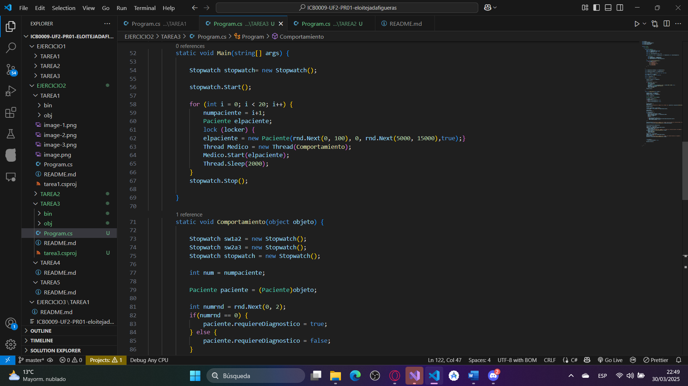

# Tarea 3

## Explica el planteamiento de tu código y plantea otra posibilidad de solución a la que has programado y porqué has escogido la tuya.
### He seguido usando un bucle for, simplemente lo ha aumentado a 20 iteraciones, se podría haber usado un Parallel.For para generar los 20 pacientes, pero entonces no se habría respetado los 2 segundos de espera entre paciente y paciente.

## Pregunta:
### ¿Los pacientes que deben esperar entran luego a la consulta por orden de llegada? Explica que tipo de pruebas has realizado para comprobar este comportamiento. 
### No lo hacen, no estan en ninguna cola que les administre así que entran desordenadamente.

static void Main(string[] args) {

            Stopwatch stopwatch= new Stopwatch();
            
            stopwatch.Start();
### Itera 20 veces en lugar de 4
            for (int i = 0; i < 20; i++) {
                numpaciente = i+1;
                Paciente elpaciente;
                lock (locker) {
                elpaciente = new Paciente(rnd.Next(0, 100), 0, rnd.Next(5000, 15000),true);}
                Thread Medico = new Thread(Comportamiento);
                Medico.Start(elpaciente);
                Thread.Sleep(2000);                
            }
            stopwatch.Stop();
       
        }

